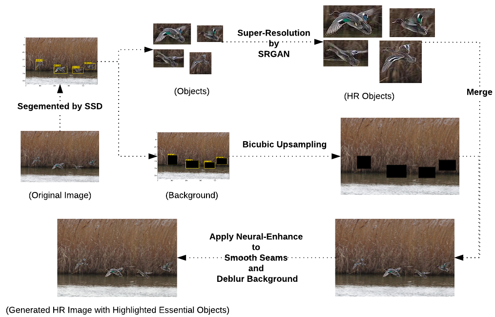
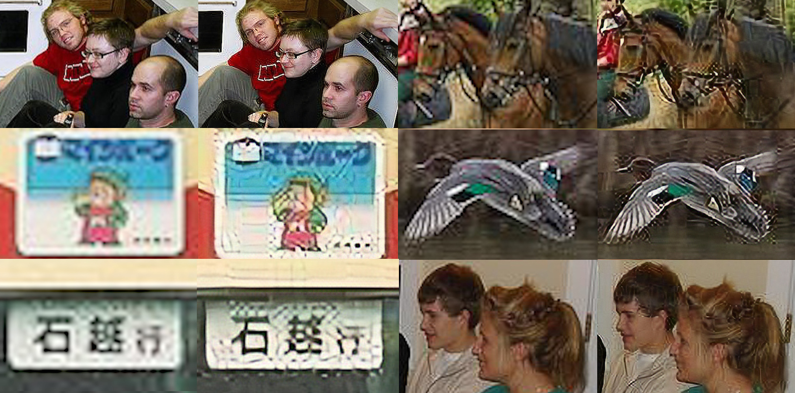
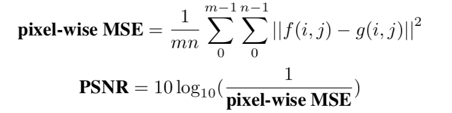

# Object-Oriented Super-Resolution Imaging

## Authors

* [**Xinsheng(Sean) Zhang**](https://github.com/nyuxz) xz1757@nyu.edu
* [**Binqian(Eric) Zeng**](http://github.com/bz866) bz866@nyu.edu

## Pipeline Overview


## Sample Results
- Object Super-Resolution Results (Original (Left) vs. Generated (Right))


## Requirements
- Python 3.6
- Theano==0.8.2
- pillow>=3.2.0
- Works on CPU or on an NVIDIA GPU
- opencv2
- Install the imutils package to leverage multi-threading on CPU:
  * pip install imutils
- The `ssd` and the `srgan` directory should be mannully removed under the `Object-orientedImageDeblurringPipelineWorkSpace` directory, as 
   * `Object-orientedImageDeblurringPipelineWorkSpace\ssd`
   * `\Object-orientedImageDeblurringPipelineWorkSpace\srgan`. 
- In following steps, we assume that users have mannually moved directories as mentioned. 

## Datasets
### VOC Dataset
PASCAL VOC: Visual Object Classes

##### Download VOC2007 trainval & test
```Shell
# specify a directory for dataset to be downloaded into, else default is ~/ssd/data
sh /ssd/data/scripts/VOC2007.sh # <directory>
```

##### Download VOC2012 trainval
```Shell
# specify a directory for dataset to be downloaded into, else default is ~/ssd/data
sh /ssd/data/scripts/VOC2012.sh # <directory>
```
### 👍Object Only Image Set(OOIS)👍
OOIS: The images we used to create Object Only Im- age Set (OOIS) is obtained from the PASCAL Vi- sual Object Classes Challenge 2012 (PascalVOC). We employ object detection model on PascalVOC to predict object bounding boxes for each im- age. Then we segment object patches by bound- ing boxes. The collection of all object patches is our new dataset.

##### Download OOIS Dataset
OOIS Google Drive Link: (https://drive.google.com/file/d/1iQZm2boHvyTAMf8LUo0fllw_PUJa0TUn/view?usp=sharing)


## Usage
 - **Pre-trained models for each module should be downloaded before using. Instructions to download pre-trained model are shown in <a href='#Download Pre-trained Models'>Download Pre-trained Models</a>
```Shell
python Main.py [-h] [--HOME_PATH] [--SSD_weights_PATH] [--size_input_images]
               [--num_classes_of_objects [--Image_ID] [Top_n_objects2Segment] [--Bicubic_UpSampling_Factor]
               [--cuda]
               
  optional arguments:
  -h, --help                    Show this help message and exit
  --HOME_PATH                   Pipeline workspace PATH; default = "~/Object-orientedImageDeblurringPipelineWorkSpace"
  --SSD_weights_PATH            pre-trained SSD model weights PATH; default = "./ssd_master/weights/ssd300_mAP_77.43_v2.pth"
  --size_input_images           Size of Input Images; default = 300
  --num_classes_of_classes      The number of object classes to score; default = 21
  --Image_ID                    The Index of target image in the dataset(PascalVOC). In the demo, the index appears at the top of Image Document Name"; Selected Image_ID for Demo must be one of [61, 73, 115, 108]
  --Top_n_objects2Segment       Maximum of Number of Objects to be Segemented; default = 61
  --Bicubic_Upsampling_Factor   Upsampling Factor for Bicubic Interpolation; 400 means zoom in x4
  --cuda                        Use cuda; 0 means on CPU, 1 means on GPU.
```

An example of training usage is shown as follows:

```Shell
python Main.py --Image_ID=108
```

#### Expected Running Time
We test 100 image samples on our pipeline. The average time to reconstruct a super-resolved object-oriented image is 1.04s. If we  apply SRGAN on the whole image, it will cost 2.179s. Therefore, our object-oriented super-resolution pipeline can provide more realistic object details and in the mean time save computational cost. 

## Download Pre-trained Models
### Module-1 Objects Segementation by SSD(https://github.com/amdegroot/ssd.pytorch)
The SSD code is based on (https://github.com/amdegroot/ssd.pytorch).  
#### Download a pre-trained SSD network
- Pre-trained model for SSD are provided in:
    * SSD300 trained on VOC0712 (newest PyTorch weights)
      - https://s3.amazonaws.com/amdegroot-models/ssd300_mAP_77.43_v2.pth
    * SSD300 trained on VOC0712 (original Caffe weights)
      - https://s3.amazonaws.com/amdegroot-models/ssd_300_VOC0712.pth
- Models should be downloaded in the `ssd/weights` dir:
```Shell
mkdir weights
cd weights
wget https://s3.amazonaws.com/amdegroot-models/vgg16_reducedfc.pth
```

### Module-2 Objects Super-Resolution with SRGAN
The SRGAN and improved SRGAN code is based on (https://github.com/amdegroot/ssd.pytorch)
- Train the SRGAN model on OOIS dataset. 
```
cd /srgan

#Original SRGAN
python src/train.py --dataset 'OOIS2012 --upscale_factor 4 --crop_size 44''

#improved SRGAN (ref:WGAN)
python src/wgan_train.py --dataset 'OOIS2012 --upscale_factor --crop_size 44''

```

### Module-3 Seams Smoothing & Background Deblurring by [**Neural-Enhance**](https://github.com/alexjc/neural-enhance)
- 
```
cd /neural-enhance  #Pre-trained model should be download into the './Object-orientedImageDeblurringPipelineWorkSpace/neural-enhance' directory
```
- Released pre-trained Neural-Enhance models are in (https://github.com/alexjc/neural-enhance/releases)
- Source code can be found in (https://github.com/alexjc/neural-enhance)

## Evauation Metrics
We use peak signal-to-noise ratio (PSNR) and structural similarity (SSIM) to evaluate and compare super-resolution algorithms.  We define PSNR score as following,



#### Experiment Quantitative Evaluation
We train SRGAN model and modified SRGAN model (based on WGAN improvement) on three different datasets: PascalVOC, OOIS, and OOIS dataset with augmentations (OOIS AUG) respec- tively. We test the model performance on the Set5 benchmark dataset. The evaluation results are shown in Table 1.

| Model                            |    PSNR    |   SSIM   |
| ---------------------------------| ---------- | -------- |
| SRGAN+PascalVOC                  |   27.671   |  0.826   |
| SRGAN+OOIS                       |   28.444   |  0.830   |
| SRGAN+OOIS AUG                   |   28.776   |  0.841   |
| ModifiedSRGAN+PascalVOC          |   28.279   |  0.827   |
| Modified SRGAN+OOIS              |   28.827   |  0.839   |
| Modified SRGAN+OOIS AUG          |   29.323   |  0.860   |

#### Qualitative Evaluation (same as sample results shown in the beginning)
- Object Super-Resolution Results (Original (Left) vs. Generated (Right))


## Conclusion and Future Work
Our super-resolution pipeline can fast produce HR images with enriched object details, and it costs around 1s per image. It shows the SRGAN trained on our OOIS dataset achieves better evaluation scores. According to WGAN, the improved SRGAN by changing loss function improves super-resolution result as well. For the future work, the smoothing can be improved. 

 

## References
- Wei Liu, Dragomir Anguelov, Dumitru Erhan, Christian Szegedy, Scott Reed, Cheng-Yang Fu, and Alexander C
Berg. Ssd: Single shot multibox detector. In European conference on computer vision, pp. 21–37. Springer,
2016.((http://arxiv.org/abs/1512.02325))
- Justin Johnson, Alexandre Alahi, and Li Fei-Fei. Perceptual losses for real-time style transfer and superresolution.
In European Conference on Computer Vision, pp. 694–711. Springer, 2016.((http://arxiv.org/abs/1603.08155))
- Wenzhe Shi, Jose Caballero, Ferenc Huszár, Johannes Totz, Andrew P Aitken, Rob Bishop, Daniel Rueckert, and
Zehan Wang. Real-time single image and video super-resolution using an efficient sub-pixel convolutional
neural network. In Proceedings of the IEEE Conference on Computer Vision and Pattern Recognition, pp.
1874–1883, 2016.((https://arxiv.org/abs/1609.05158)). 
- Jiwon Kim, Jung Kwon Lee, and Kyoung Mu Lee. Deeply-recursive convolutional network for image superresolution.
In Proceedings of the IEEE conference on computer vision and pattern recognition, pp. 1637–1645,
2016.((https://arxiv.org/abs/1511.04491))
- Christian Ledig, Lucas Theis, Ferenc Huszár, Jose Caballero, Andrew Cunningham, Alejandro Acosta, Andrew
Aitken, Alykhan Tejani, Johannes Totz, Zehan Wang, et al. Photo-realistic single image super-resolution
using a generative adversarial network. arXiv preprint, 2016.((https://arxiv.org/abs/1609.04802))

